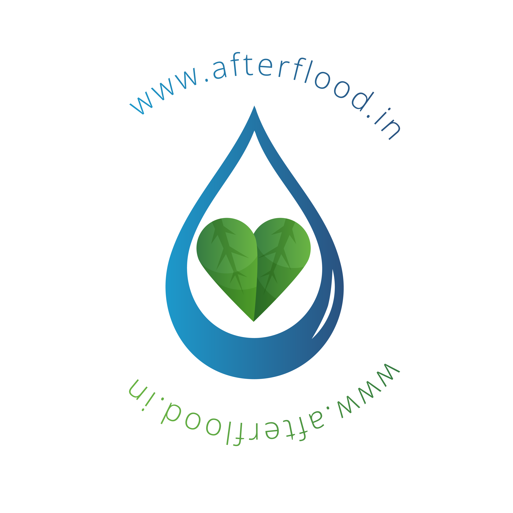

# \#AfterFlood \(\#ಪ್ರವಾಹದನಂತರ\)


**Please do not use Sodium polyacrylate for cleaning flood water**  
[**Read More: https://www.afterflood.in/cleaning/**](https://www.afterflood.in/easy-hack-for-cleaning)\*\*\*\*


## Health Management \(ಆರೋಗ್ಯ ನಿರ್ವಹಣೆ\)

**ರೋಗ ತಡೆಗಟ್ಟುವುದು**



**ನೀರಿನ ಶುಚಿತ್ವ** 



**ಆಹಾರ ಹಾಗೂ ಔಷಧ ವಿಲೇವಾರಿ** 



 **ದೈಹಿಕ ನೈರ್ಮಲ್ಯ** 



**ಪ್ರವಾಹಾನಂತರ ಅವಶ್ಯಕವಾಗಿ ಇಟ್ಟುಕೊಳ್ಳಬೇಕಾದ ಔಷಧಗಳು**



## Waste Management \(ತ್ಯಾಜ್ಯ ನಿರ್ವಹಣೆ\)

**ಆಹಾರ ಮತ್ತು ಕಾಗದ ಕಸ ವಿಲೇವಾರಿ** 



**ಏನೇನು ಬಿಸಾಡುವುದು/ ಉಳಿಸಿಕೊಳ್ಳುವುದು?** 



## Safety  Management \(ಸುರಕ್ಷತಾ ನಿರ್ವಹಣೆ\)

**ಹಿಂತಿರುಗುವ ಮುನ್ನ ಖಚಿತ ಪಡಿಸಿಕೊಳ್ಳಲೇಬೇಕಾದದ್ದು**



**ಏನೇನು ಬಿಸಾಡುವುದು/ ಉಳಿಸಿಕೊಳ್ಳುವುದು?**



**ಸುರಕ್ಷಿತವಾಗಿ ಮನೆಗೆ ಹಿಂದಿರುಗೋಣ**



**ಹಿಂದಿರುಗುವಾಗ ಅಗತ್ಯವಾಗಿ ಬೇಕಾಗಿರುವ ವಸ್ತುಗಳು**



**ಮನೆ ಸ್ವಚ್ಛತೆಗೆ ಬೇಕಾದ ಸಿದ್ಧತೆ** 



**ನೆಲ ಸ್ವಚ್ಛಗೊಳಿಸುವ ವಿಧಾನ** 



**ಉಪಯೋಗಿಸಲೇಬಾರದು - ಸೋಡಿಯಮ್ ಪಾಲಿಅಕ್ರಲೇಟ್** 



 **ಬಾವಿ ಸ್ವಚ್ಛಗೊಳಿಸುವ ವಿಧಾನ** 



**ಪೀಠೋಪಕರಣ ಹಾಗೂ ನೆಲಗಂಬಳಿ ಶುಚಿಗೊಳಿಸುವಿಕೆ**



 **ಫ್ರಿಡ್ಜ್ ಸರಿಪಡಿಸುವ ವಿಧಾನ** 



**ವಾಹನ/ಕಾರು ಮುಳುಗಡೆಯಾದಾಗ ಅನುಸರಿಸಬಹುದಾದ ಸಲಹೆಗಳು**



**ಹಾವುಗಳ ನಿರ್ವಹಣೆ - ವಿವರವಾದ ಸೂಚನೆಗಳು**



**ಹಾನಿಗೊಳಿಸದೆ ಕಟ್ಟಡ ಪರೀಕ್ಷೆ ಮಾಡುವ ವಿಧಾನಗಳು**



## Videos \(ವೀಡಿಯೊಗಳು\)

**ಪ್ರವಾಹಾನಂತರ ರೋಗ ತಡೆ/ನಿಯಂತ್ರಣ** 



**ನೀರಿಗಿಳಿಯುವ ಮುನ್ನ ನೆನಪಿಡಲೇಬೇಕಾದ ಸಂಗತಿಗಳು** 



**ಮನೆಗೆ ಮರಳುವ ಮುನ್ನ ನೆನಪಿಡಲೇಬೇಕಾದ ಸಂಗತಿಗಳು**



**ಪ್ರವಾಹಾನಂತರ ಮನೆ ಶುಚಿಗೊಳಿಸುವ ವಿಧಾನ** 



**ಮನೆಯ ಸುರಕ್ಷತೆ ಖಚಿತಪಡಿಸಿಕೊಳ್ಳುವುದು \(Video ದೃಶ್ಯಾವಳಿ\)**



**ಬಾವಿಯ ನೀರನ್ನು ಶುಚಿಗೊಳಿಸುವ ವಿಧಾನ \(ದೃಶ್ಯಾವಳಿ\)**  



 **ಕುಡಿಯುವ ನೀರು ಶುದ್ಧೀಕರಣ \(ದೃಶ್ಯಾವಳಿ\)**



**ಸಂದೇಶ ಕೊಡುವಾಗ ಮನನ ಮಾಡಬೇಕಾದ ಐದು ಅಂಶಗಳು \( ದೃಶ್ಯಾವಳಿ\)**



## General Note \(ಒಟ್ಟಾರೆ ಸೂಚನೆ\)


## Ensure building safety


* Make sure the building is structurally safe.
* Look for buckled walls or floors.
* Watch for holes in the floor, broken glass and other potentially dangerous debris.


## **Travel with care.**


* Follow recommended routes. DO NOT sightsee.
* Watch for washed out roads, earth slides, and downed trees or power lines.
* Stay away from downed power lines.


## Contribute to www.afterflood.in


1. Fork the [Github Repo](https://github.com/afterflood/kannada.afterflood.in)
2. Add a new page and update `Readme.md & Summary.md`
3. Send a PR with your Update

Or email us at `afterflood.in@gmail.com`



